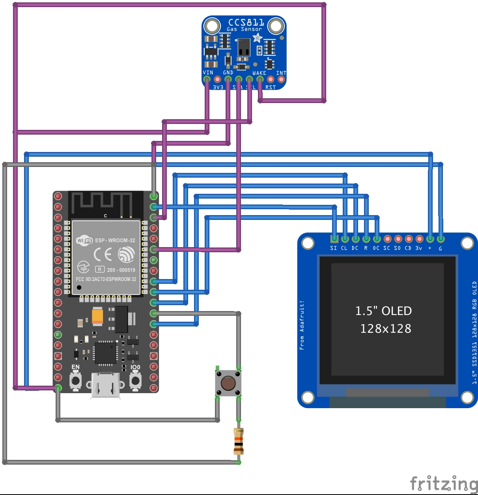

## Esp32 based Air Quality Display

### Components
- ESP32 WROOM 32
- CC811b Ari Quality Sensor
- SSD1351 OLED display

### Fritzing Schematic

### License Information
This code is open source!

Please review the LICENSE.md file for license information.
Distributed as-is; no warranty is given.
